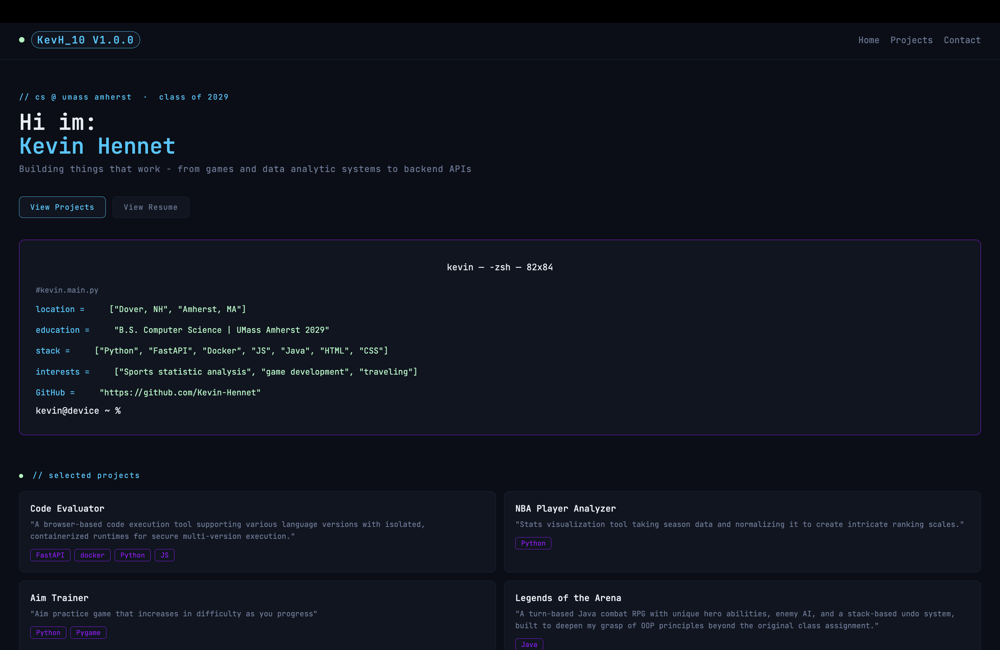

# Kevin Hennet — Personal Portfolio

Personal portfolio website showcasing my projects and background as a CS student at UMass Amherst.

🔗 **Live site:** https://kevin-hennet.github.io/personal-portfolio/


## Tech Stack

- HTML, CSS, JavaScript (vanilla)
- Hosted on GitHub Pages

## Features

- Typing animation on hero name
- Terminal-style bio block
- Project cards linking to GitHub repos
- Smooth scroll navigation

## Run Locally

No build steps needed — just clone and open:

```bash
git clone https://github.com/Kevin-Hennet/personal-portfolio.git
cd personal-portfolio
open index.html
```

